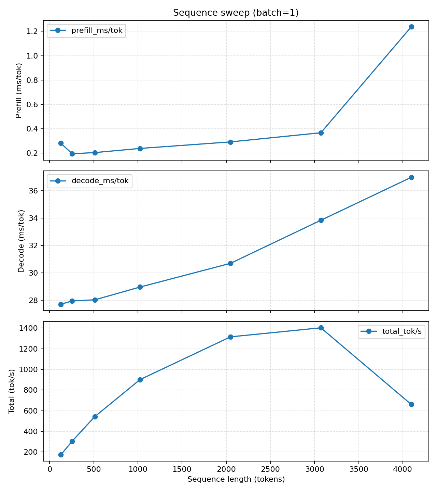
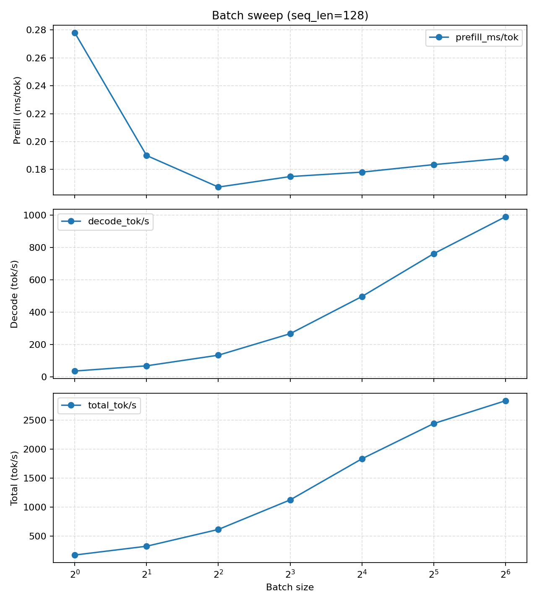

# LLM Latency Sensitivity Analysis on RTX 5070

This repository presents an empirical study of GPU efficiency in LLM inference under two distinct operating regimes:

### 1. Increasing context length for a single request (batch = 1)

This experiment measures how GPU efficiency changes as sequence length grows for an isolated request. It captures
prefill efficiency, decode behavior, and total throughput as context length increases.



### 2. Fixed context length with increasing parallelism (batching)

This experiment holds sequence length constant and increases the number of concurrent requests. It demonstrates how
batching exposes parallelism and improves throughput without increasing per-token compute cost.



The remainder of this document explains the experimental setup, measurement methodology, and the implications of these
results for LLM serving systems.

## 1. Introduction

Inference performance is often discussed in terms of context length. As models support longer prompts, it is natural to
assume that processing more tokens in a single request should improve GPU utilization and reduce latency per token.

In practice, this assumption conflates two different effects: **sequence length** and **concurrency**. Increasing
sequence length adds more work to a single request, while batching increases the number of independent requests
processed in parallel. Although both increase total token count, they do not produce the same behavior on GPUs.

This study separates these axes explicitly. **We measure inference performance by (1) increasing sequence length at
batch size one, and (2) increasing batch size at fixed sequence length, tracking prefill latency, per-token efficiency,
throughput, and memory usage in each case.**

The results show a consistent pattern. Increasing sequence length alone does not improve per-token efficiency
and eventually increases latency due to memory pressure. In contrast, increasing batch size significantly
improves throughput while largely preserving per-token efficiency until saturation.

The rest of this article presents the measurements supporting these observations and discusses their
implications for LLM serving systems, focusing on end-to-end behavior rather than kernel-level analysis.

## 2. Experimental Setup and Methodology

### Hardware and Model Configuration

All experiments were run on a single **RTX 5070 (12 GB VRAM)** using **Qwen2.5-3B** in **FP16** precision.
The model size and precision were chosen to allow a wide sweep of sequence lengths and batch sizes without
immediate out-of-memory failures, while still exercising realistic inference behavior.

### Measurement Approach

Inference latency and throughput were measured end-to-end at the request level. Metrics were collected for both prefill
and decode phases, along with total throughput and GPU memory usage. The focus of this study is observable serving
behavior rather than kernel-level attribution.

### Prefill vs Decode Separation

Prefill (processing the input prompt) and decode (autoregressive token generation) were measured separately. These
phases have distinct scaling characteristics and are affected differently by sequence length and batching. Aggregating
them would obscure their individual contributions to latency and throughput.

### Aggregation, Warmup, and Repetitions

All reported metrics use median (p50) values to reduce sensitivity to outliers. Each configuration includes controlled
warmup iterations to stabilize caches and execution paths, followed by multiple measured runs under identical
conditions.

### Independent Axes: Sequence Length vs Batch Size

Sequence length and batch size are treated as independent variables. Increasing sequence length increases work within
a single request, while increasing batch size increases the number of independent requests processed concurrently.
Although both increase total token count, they exercise the GPU in fundamentally different ways. Separating these axes
is essential to attributing observed performance changes correctly.

## 3. Sequence Length Sweep: Single-Request Long Context

To isolate the effect of context length, we measure inference performance for a single request **(batch = 1)** while
increasing sequence length from **128 to 4096 tokens**. All other variables are held constant.

`Table 1: Prefill + Memory (batch size = 1, increasing context length)`


| seq_len | prefill_p50 (ms) | prefill_ms/tok | prefill_tok/s | VRAM_reserved (MB)  |
|---------|------------------|----------------|----------------|--------------------|
| 128     | 34.79            | 0.271821       | 3678.9         | 5974.0             |
| 256     | 48.59            | 0.189817       | 5268.2         | 6054.0             |
| 512     | 97.41            | 0.190260       | 5256.0         | 6212.0             |
| 1024    | 248.47           | 0.242645       | 4121.2         | 6538.0             |
| 2048    | 602.25           | 0.294068       | 3400.6         | 7412.0             |
| 3072    | 1128.15          | 0.367237       | 2723.0         | 8880.0             |
| 4096    | 1756.57          | 0.428849       | 2331.8         | 12116.0            |

### Prefill Latency

Prefill latency increases rapidly with sequence length, growing from ** 35 ms at 128 tokens to 1.76 s at 4096 ** tokens.
The growth is more than linear, reflecting the increasing cost of processing longer prompts within a single request.

### Per-Token Efficiency

Per-token prefill efficiency degrades monotonically as sequence length increases. Prefill latency per token rises from
** 0.27 ms/token at 128 tokens ** to ** 0.43 ms/token ** at 4096 tokens, while prefill throughput drops from
**~3.7k tokens/s to ~2.3k tokens/s**. At no point does longer context improve per-token efficiency.

### Decode Behavior

`Table 2: Decode + Throughput  (batch size = 1, increasing context length)`

| seq_len | decode_p50 (ms/tok) | decode_tok/s | total_tok/s |
|--------:|--------------------:|-------------:|------------:|
| 128     | 26.119              | 38.29        | 183.78      |
| 256     | 26.107              | 38.30        | 325.79      |
| 512     | 26.433              | 37.83        | 576.71      |
| 1024    | 26.997              | 37.04        | 949.31      |
| 2048    | 29.386              | 34.03        | 1348.36     |
| 3072    | 32.294              | 30.97        | 1435.99     |
| 4096    | 36.124              | 27.68        | 1417.33     |

Decode performance also degrades with sequence length. Decode latency per token increases
from **26 ms/token to 36 ms/token**, and decode throughput falls from **38 tokens/s to
28 tokens/s**. This indicates that longer context negatively affects not only prefill but
also steady-state generation.

These results are captured in the figure below:


### Throughput

Total throughput increases initially as more tokens are processed per request, peaking around **3072 tokens**, and then
plateaus and slightly declines at **4096 tokens**. The apparent throughput gain at intermediate lengths is driven by
increased work per request, not by improved efficiency.

### Memory Consumption

GPU memory usage grows steadily with sequence length, from **~6.0 GB** at 128 tokens to **~12.1 GB** at 4096 tokens.
The largest increase coincides with the flattening and decline in throughput, indicating growing memory pressure.

### What Does Not Improve

There is no regime in which longer context leads to faster per-token execution or
improved efficiency. The GPU does not become more efficient as sequence length increases. Instead, latency rises,
per-token efficiency degrades, and throughput eventually saturates.

**Key result**: increasing sequence length for a single request produces a monotonic decline in per-token efficiency.

## 4. Batching Sweep: Increasing Concurrency at Fixed Context
To isolate the effect of concurrency, we fix the sequence length at **128** tokens and increase batch size from **1 to
64**.
This increases the number of independent requests processed in parallel while keeping per-request work constant.

### Prefill Behavior Under Increasing Batch Size (at fixed context length)

`Table 3:   Prefill + Memory (batch size increasing, fixed context length of 128)`

| batch | prefill_p50 (ms) | prefill_ms/tok | prefill_tok/s | VRAM_reserved (MB) |
|------:|-----------------:|---------------:|--------------:|-------------------:|
| 1     | 34.18            | 0.267005       | 3745.2        | 5974.0             |
| 2     | 46.31            | 0.180888       | 5528.3        | 6054.0             |
| 4     | 84.44            | 0.164931       | 6063.1        | 6216.0             |
| 8     | 188.99           | 0.184556       | 5418.4        | 6538.0             |
| 16    | 361.28           | 0.176408       | 5668.7        | 7154.0             |
| 32    | 750.95           | 0.183337       | 5454.4        | 8342.0             |
| 64    | 1547.56          | 0.188911       | 5293.5        | 10716.0            |

As batch size increases, prefill latency rises as expected due to increased total work. However, **per-token prefill
efficiency remains largely stable**, **staying within a narrow band (~0.16–0.19 ms/token)**. Prefill throughput improves
substantially and remains high until the largest batch sizes, indicating effective utilization of GPU parallelism.

### Decode behavior Under Increasing Batch Size (at fixed context length)

`Table 4: Decode + Throughput  (increasing batch size, fixed context length of 128)`

| batch | decode_p50 (ms/tok) | decode_tok/s | total_tok/s |
|------:|--------------------:|-------------:|------------:|
| 1     | 26.586              | 37.61        | 180.81      |
| 2     | 26.943              | 74.23        | 352.23      |
| 4     | 28.164              | 142.03       | 649.29      |
| 8     | 28.746              | 278.30       | 1154.35     |
| 16    | 31.288              | 511.38       | 1878.90     |
| 32    | 40.461              | 790.89       | 2502.82     |
| 64    | 64.221              | 996.56       | 2842.37     |

Decode throughput scales strongly with batch size, driving near-linear increases in total throughput up to **batch 32**.
Beyond this point, decode latency per token rises sharply, signaling the onset of saturation. Throughput continues to
increase, but with diminishing returns.

The plot below captures the above metrics


### Comparison with Single-Request Long Context

Unlike the sequence-length sweep at batch size one, batching does not degrade per-token efficiency. At fixed context
length, increasing batch size improves throughput by increasing concurrency rather than increasing per-request compute
or memory pressure.

### Key Result

**Batching increases GPU efficiency by exposing parallel independent work, not by increasing per-request complexity.**
In contrast to long-context single-request runs, batching achieves higher throughput while largely preserving per-token
efficiency until the GPU reaches saturation.

## 5. Same Tokens, Different Outcomes: Context Length vs Concurrency

At a high level, increasing sequence length and increasing batch size both raise the total number of tokens processed
by the GPU. From that perspective, it is tempting to treat them as interchangeable. The measurements in the previous
sections show that they are not.

In the **single-request, long-context** runs, throughput increases initially as more tokens are processed per request,
but per-token efficiency steadily degrades. Prefill latency per token rises, decode slows down, and throughput
eventually plateaus and declines as memory pressure grows. Increasing sequence length adds more work to a single,
dependent execution path.

In contrast, **the batched, short-context** runs show a different behavior. As batch size increases, throughput scales
strongly while per-token efficiency remains largely stable over a wide range. Prefill and decode costs grow with total
work, but efficiency is preserved until the GPU approaches saturation. Each request remains independent, allowing
parallel execution to be exploited effectively.

The key distinction is not the total number of tokens processed, but the **independence of work**. Long context
increases the size of one request, while batching increases the number of concurrent requests. Although both increase
token count, they exercise the GPU in fundamentally different ways.

Empirically, the results show that GPUs become more efficient when given more **independent parallel work**, not when
asked to process longer serial workloads. Token count alone is not a reliable predictor of efficiency; how those tokens
are organized across requests matters far more.

## 6. Prefill vs Decode: Divergent Scaling Regimes

Across all experiments, prefill and decode exhibit fundamentally different scaling behavior, and their contributions to
end-to-end latency diverge as either sequence length or batch size increases.

### Why Prefill Dominates Latency Behavior

Prefill processes the entire input context in a single phase. As sequence length increases, prefill latency grows
rapidly and becomes the dominant contributor to total request latency. This behavior is consistently observed in the
single-request long-context runs, where prefill latency increases from tens of milliseconds to multiple seconds as
context length grows from 128 to 4096 tokens.

Even in batched runs at fixed context length, prefill remains a significant cost, but its per-token efficiency is
largely preserved. This contrast highlights that prefill sensitivity is driven by the amount of work within a request,
not by concurrency itself.

### Why Decode Never Benefits from “batching”

Decode operates one token at a time and is bounded by sequential dependencies. Across both sequence-length and batching
sweeps, decode latency per token never improves as context length increases. In fact, decode performance steadily
degrades with longer context and only scales with batch size through parallelism across independent requests.

There is no regime in which decode becomes faster per token due to longer prompts. Any apparent gains in total
throughput stem from processing more tokens overall, not from improved decode efficiency.

### Practical Implications for Serving Systems

These divergent behaviors have direct implications for inference serving. Optimizations that target batching and
concurrency primarily benefit decode throughput, while long-context requests disproportionately increase prefill
latency and tail response times. Systems that do not separate or manage these phases risk overestimating the efficiency
gains of long-context inference.

### Measurement-Based Confirmation

These conclusions are drawn directly from end-to-end measurements of latency, throughput, and memory usage. No
kernel-level profiling or architectural assumptions are required to observe the divergence between prefill and decode
scaling behavior. The distinction emerges clearly at the request level and is sufficient to guide practical system
design.

## 7. Distinguishing the Metrics


- **Total latency** measures the end-to-end time to process a request. It naturally increases as more tokens are
processed, regardless of efficiency.

- **Latency per token** reflects execution efficiency and is the most relevant metric for understanding GPU utilization.
Throughput measures total tokens processed per unit time and can increase simply by doing more work per request.

These metrics are related but not interchangeable. Improvements in one do not imply improvements in the others.

### Fixed-Cost Amortization vs Efficiency

In the sequence-length sweep, total throughput increases initially as sequence length grows. This can give the
impression of improved efficiency in latency. However, the per-token metrics show the opposite trend:
latency per token increases steadily, and per-token throughput declines.

The apparent throughput gains are explained by fixed-cost amortization - overheads such as setup and scheduling are
spread over more tokens - not by faster execution per token. No regime shows a reduction in per-token latency as
sequence length increases.

### Real Failure Points

The true performance cliffs appear when memory pressure increases. As sequence length grows, GPU memory usage rises
sharply, eventually flattening or reducing throughput and increasing latency across both prefill and decode. These
inflection points correspond to resource pressure, not to a transition into a more efficient execution regime.

The drop in per-token latency at longer context lengths isn’t evidence of GPUs becoming more efficient. The initial
improvement comes from amortizing fixed overhead across more tokens; beyond that, performance degrades as memory usage,
KV cache size, and scheduling pressure increase. True cliffs occur due to resource exhaustion, not efficiency gains.

## 8. Implications for LLM Serving Architectures

The measurements in this study have direct implications for how LLM inference systems should be designed and operated.
In particular, they clarify which optimizations meaningfully improve GPU efficiency and which do not.

### Why Naive FastAPI-Based Serving Wastes GPUs Under Load
A common serving pattern is to expose a model through a simple request–response API, processing each request
independently as it arrives. Under this model, GPUs frequently operate in a low-concurrency regime, especially when
requests are serialized or lightly parallelized.

The measurements show that in this regime, increasing sequence length does not improve per-token efficiency. As a
result, GPUs spend most of their time underutilized, even as request latency grows. Longer prompts increase latency and
memory pressure without delivering efficiency gains.

### Why Batching Is Mandatory for Efficiency

Efficient GPU utilization requires exposing parallel, independent work. Batching achieves this by allowing multiple
requests to be processed concurrently, enabling throughput to scale while largely preserving per-token efficiency until
saturation.

The batching sweep demonstrates that meaningful throughput gains come from concurrency, not from larger single requests.
Without batching, even powerful GPUs behave like overprovisioned accelerators, delivering poor efficiency per dollar.

### When Inference Engines Like vLLM Actually Matter

Inference engines such as vLLM matter most in high-concurrency environments, where they can aggregate requests, manage
batching dynamically, and keep GPUs consistently saturated. In these scenarios, scheduling and batching strategies
directly translate into higher throughput and better hardware utilization.

### When They Do Not Matter

In low-concurrency regimes - such as development workloads, lightly loaded services, or single-user deployments -
the choice of inference engine has limited impact. Without sufficient concurrent requests, there is little parallelism
to exploit, and no framework can compensate for the absence of independent work.

In short, serving architecture choices only pay off when the workload exposes concurrency. Without it, GPUs remain
inefficient regardless of model size or prompt length.

## 9. Limitations and Scope

This study focuses on inference behavior observed on a single GPU class. While the absolute performance characteristics
will differ across hardware, the analysis is intended to highlight qualitative trends rather than hardware-specific
peak numbers.

The measurements emphasize end-to-end serving behavior, including latency, throughput, and memory usage, as observed at
the request level. No attempt is made to attribute results to specific kernels, scheduling decisions, or architectural
features. This is a deliberate choice to keep the analysis grounded in observable system behavior.

Detailed kernel-level profiling and architectural attribution require a different methodology and set of tools.
Such analysis is intentionally deferred to follow-up work, where Nsight-based profiling can be used to explain why these
behaviors occur without retroactively shaping the empirical findings presented here.

## 10. Conclusion: GPUs Want Parallelism, Not Longer Prompts

The measurements in this study show a consistent pattern: increasing sequence length for a single request does not
improve GPU efficiency. As context grows, per-token latency increases, throughput eventually saturates, and memory
pressure becomes the dominant constraint. There is no regime in which longer prompts make inference faster or more
efficient on a per-token basis.

In contrast, increasing concurrency through batching exposes parallel, independent work and leads to substantial
throughput gains while largely preserving per-token efficiency until the GPU approaches saturation. The difference is
not the number of tokens processed, but how those tokens are organized across requests.

For practitioners, the operational takeaway is straightforward. Efficient LLM serving requires concurrency. Systems
that rely on single-request execution, even with long prompts, will underutilize GPUs and incur unnecessary latency.
Batching is not an optional optimization; it is a prerequisite for efficient inference.

This article focused on end-to-end behavior and measurable outcomes. Follow-up work will examine the underlying causes
at the kernel and memory-system level, using profiling tools to explain why GPUs respond so differently to long-context
single requests versus batched execution.

## Appendix

### A. Reproducibility and CLI Commands

All measurements in this article were generated using the same sweep tool and configuration, varying only sequence
length or batch size as described in the main sections. The commands below reproduce the two primary experiments.

#### Sequence length sweep (batch size = 1):

```powerShell
latency-sensitivity sweep `
  --model Qwen/Qwen2.5-3B-Instruct `
  --dtype fp16 `
  --device cuda `
  --seq 128,256,512,1024,2048,3072,4096 `
  --batch-sizes 1 `
  --gen-tokens 32 `
  --warmup 3 `
  --reps 7 `
  --out results/sweeps/qwen25_3b_fp16_grid_fixed_batch.csv
```

#### Batching sweep (fixed sequence length, increasing batch size):


```powerShell
latency-sensitivity sweep `
  --model Qwen/Qwen2.5-3B-Instruct `
  --dtype fp16 `
  --device cuda `
  --seq 128 `
  --batch-sizes 1,2,4,8,16,32,64 `
  --gen-tokens 32 `
  --warmup 3 `
  --reps 7 `
  --out results/sweeps/qwen25_3b_fp16_grid_fixed_seq.csv
```

All runs use identical warmup, repetition counts, and generation length to ensure comparability across configurations.

### B. CSV Schema and Metric Definitions

| **Column**              | **Meaning**                                                                 |
|---------------------|-------------------------------------------------------------------------|
| **seq_len**             | Number of input tokens processed during the prefill phase.              |
| **batch**               | Number of independent requests processed concurrently.                  |
| **prefill_p50 (ms)**    | Median end-to-end latency of the prefill phase.                         |
| **prefill_ms/tok**      | Median prefill latency normalized per input token.                      |
| **prefill_tok/s**       | Effective prefill throughput in tokens per second.                      |
| **decode_p50 (ms/tok)** | Median latency per generated token during decode.                       |
| **decode_tok/s**        | Decode throughput in tokens per second.                                 |
| **total_tok/s**         | End-to-end throughput across prefill and decode.                        |
| **VRAM_reserved (MB)**  | GPU memory reserved during the run, sampled at steady state.            |
| **flag**                | Optional annotation for detected collapse or failure conditions.        |

All reported values in the article use median (p50) aggregation.

### C. Notes on Collapse Detection Thresholds

The `--collapse-factor` parameter is used to annotate potential collapse points in the output. A configuration is
flagged when per-token latency or throughput degrades by more than the specified factor relative to earlier
configurations in the sweep.

In this study, a collapse factor of `2` is used conservatively. Importantly, flagged conditions are not treated as
evidence of improved efficiency followed by failure. Instead, they are used to highlight regions where memory pressure
or resource saturation becomes dominant.

All conclusions in the main article are based on the raw metrics rather than the presence or absence of collapse flags.
